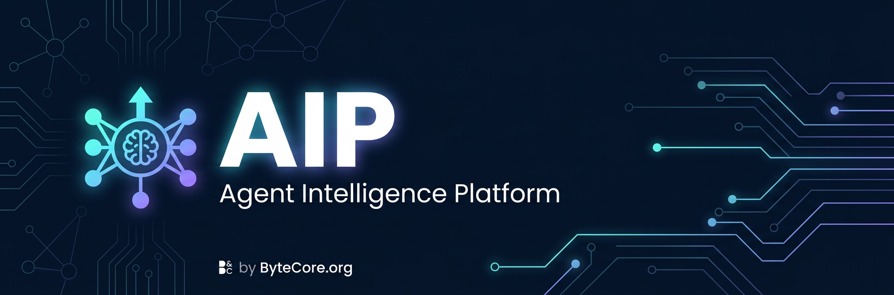

**Ngôn ngữ:** [English](../../README.md) | [Português (Brasil)](../pt-BR/README.md) | [简体中文](../../README.zh-CN.md) | [繁體中文](../zh-TW/README.md) | [日本語](../ja-JP/README.md) | [한국어](../ko-KR/README.md) | [Türkçe](../tr/README.md) | [Русский](../ru/README.md) | **Tiếng Việt** | [ไทย](../th/README.md) | [Deutsch](../de-DE/README.md) | [Українська](../uk-UA/README.md)

# AIP



[](https://github.com/idrisvale-dev/AIP/stargazers)
[](https://github.com/idrisvale-dev/AIP/network/members)
[](https://github.com/idrisvale-dev/AIP/graphs/contributors)
[](https://www.npmjs.com/package/aip-universal)
[](../../LICENSE)

> **140K+ sao** | **21K+ fork** | **170+ contributor** | **12+ hệ sinh thái ngôn ngữ** | **Anthropic Hackathon Winner**

---

<div align="center">

**Ngôn ngữ / Language / 语言 / 語言 / Dil / Язык**

[English](../../README.md) | [Português (Brasil)](../pt-BR/README.md) | [简体中文](../../README.zh-CN.md) | [繁體中文](../zh-TW/README.md) | [日本語](../ja-JP/README.md) | [한국어](../ko-KR/README.md) | [Türkçe](../tr/README.md) | [Русский](../ru/README.md) | **Tiếng Việt** | [ไทย](../th/README.md) | [Deutsch](../de-DE/README.md) | [Українська](../uk-UA/README.md)

</div>

---

**AIP là hệ thống tối ưu hiệu năng cho AI agent harness.**

AIP không chỉ là một bộ cấu hình. Repo này đóng gói agents, skills, hooks, rules, MCP config, selective install, kiểm tra bảo mật, và workflow vận hành cho Claude Code, Codex, Cursor, OpenCode, Gemini và các harness agent khác.

Trang tiếng Việt này là bản onboarding gọn, được phục hồi từ đóng góp cộng đồng trong PR [#1322](https://github.com/idrisvale-dev/AIP/pull/1322) và cập nhật để khớp mặt cài đặt hiện tại. README tiếng Anh vẫn là nguồn chuẩn đầy đủ nhất.

---

## Bắt Đầu Nhanh

### Chọn một đường cài đặt duy nhất

Với Claude Code, phần lớn người dùng nên chọn đúng **một** trong hai đường:

- **Khuyến nghị:** cài plugin Claude Code, sau đó copy thủ công chỉ những thư mục `rules/` bạn thật sự cần.
- **Dùng installer thủ công** nếu bạn muốn kiểm soát chi tiết hơn, muốn tránh plugin, hoặc bản Claude Code của bạn không resolve được marketplace tự host.
- **Không chồng nhiều cách cài lên nhau.** Cấu hình dễ hỏng nhất là `/plugin install` trước, rồi chạy tiếp `install.sh --profile full` hoặc `npx aip-universal install --profile full`.

Nếu bạn đã cài chồng nhiều lần và thấy skill/hook bị trùng, xem [Reset / Gỡ AIP](#reset--gỡ-aip).

### Cài plugin Claude Code

```bash
# Thêm marketplace
/plugin marketplace add https://github.com/idrisvale-dev/AIP

# Cài plugin
/plugin install aip@aip
```

AIP có ba định danh công khai khác nhau:

- Repo GitHub: `idrisvale-dev/AIP`
- Plugin Claude marketplace: `aip@aip`
- Gói npm: `aip-universal`

Các tên này cố ý khác nhau. Plugin Claude Code dùng `aip@aip`; npm vẫn dùng `aip-universal`.

### Copy rules nếu cần

Plugin Claude Code không tự phân phối `rules/`. Nếu bạn đã cài bằng plugin, **đừng** chạy thêm full installer. Hãy copy riêng rule pack bạn muốn:

```bash
git clone https://github.com/idrisvale-dev/AIP.git
cd aip

mkdir -p ~/.claude/rules/aip
cp -R rules/common ~/.claude/rules/aip/
cp -R rules/typescript ~/.claude/rules/aip/
```

```powershell
git clone https://github.com/idrisvale-dev/AIP.git
cd aip

New-Item -ItemType Directory -Force -Path "$HOME/.claude/rules/aip" | Out-Null
Copy-Item -Recurse rules/common "$HOME/.claude/rules/aip/"
Copy-Item -Recurse rules/typescript "$HOME/.claude/rules/aip/"
```

Copy cả thư mục ngôn ngữ, ví dụ `rules/common` hoặc `rules/golang`, thay vì copy từng file riêng lẻ.

### Cài thủ công nếu không dùng plugin

Chỉ dùng đường này nếu bạn cố ý bỏ qua plugin:

```bash
npm install
./install.sh --profile full
```

```powershell
npm install
.\install.ps1 --profile full
# hoặc
npx aip-universal install --profile full
```

Nếu chọn đường thủ công, dừng ở đó. Đừng chạy thêm `/plugin install`.

### Đường low-context / không hooks

Nếu bạn chỉ muốn rules, agents, commands và core workflow skills, dùng profile tối thiểu:

```bash
./install.sh --profile minimal --target claude
```

```powershell
.\install.ps1 --profile minimal --target claude
# hoặc
npx aip-universal install --profile minimal --target claude
```

Profile này cố ý không cài `hooks-runtime`.

---

## Reset / Gỡ AIP

Nếu AIP bị trùng, quá xâm lấn, hoặc hoạt động sai, đừng tiếp tục cài đè lên chính nó.

- **Đường plugin:** gỡ plugin trong Claude Code, rồi xoá các rule folder bạn đã copy thủ công dưới `~/.claude/rules/aip/`.
- **Đường installer/CLI:** từ root repo, preview trước:

```bash
node scripts/uninstall.js --dry-run
```

Sau đó gỡ các file do AIP quản lý:

```bash
node scripts/uninstall.js
```

Bạn cũng có thể dùng lifecycle wrapper:

```bash
node scripts/aip.js list-installed
node scripts/aip.js doctor
node scripts/aip.js repair
node scripts/aip.js uninstall --dry-run
```

AIP chỉ xoá file có trong install-state của nó. Nó không xoá file không liên quan.

---

## Tài Liệu Quan Trọng

- [README tiếng Anh](../../README.md) - nguồn chuẩn đầy đủ nhất
- [Hướng dẫn Hermes](../HERMES-SETUP.md)
- [Release notes v2.0.0-rc.1](../releases/2.0.0-rc.1/release-notes.md)
- [Kiến trúc cross-harness](../architecture/cross-harness.md)
- [Troubleshooting](../TROUBLESHOOTING.md)
- [Hook bug workarounds](../hook-bug-workarounds.md)

---

## Dùng Thử

```bash
# Plugin install dùng namespace đầy đủ
/aip:plan "Thêm xác thực người dùng"

# Manual install giữ dạng slash ngắn
# /plan "Thêm xác thực người dùng"

# Xem plugin đang cài
/plugin list aip@aip
```

AIP hiện cung cấp hàng chục agent, hơn 200 skill và legacy command shim cho các workflow agent khác nhau. Kiểm tra README tiếng Anh để xem danh sách và hướng dẫn chi tiết nhất.
